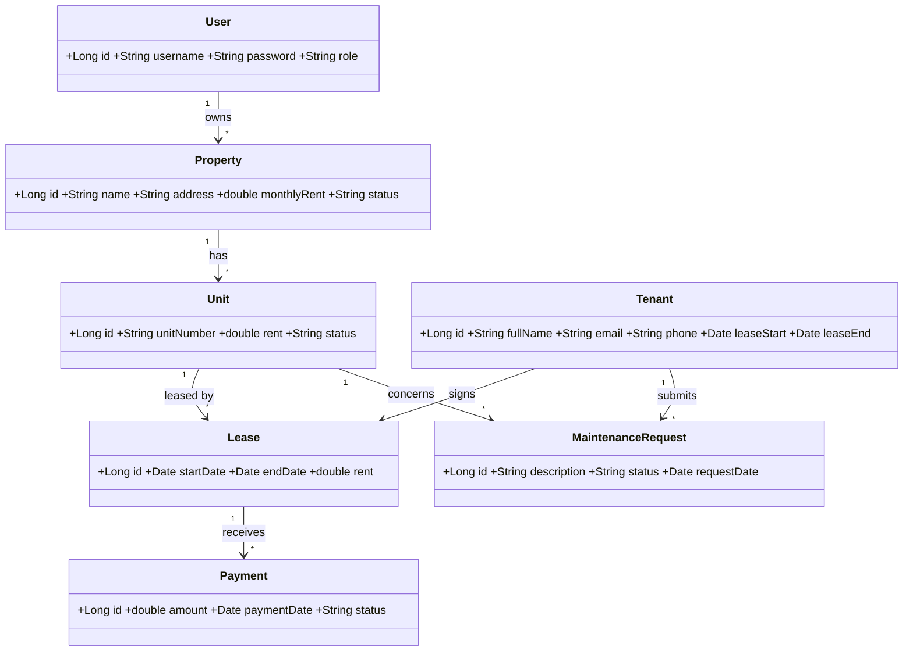

# Rental Property & Tenant Management System: Documentation

**Student:** SINGIZA GIHOZO Macrine  |  **ID:** 27677
**GitHub link:** <PASTE HERE>
**Video link:** <PASTE HERE>

## 1. Abstract
The Rental Property & Tenant Management System is a web application that helps landlords and property managers manage properties, tenants, leases, rent payments, and maintenance requests in one place. It replaces paper records and spreadsheets with a centralized database, reducing errors, missed payments, and slow follow-up. It is built with JavaServer Faces (JSF) for the interface and Hibernate for database access, with MySQL as the data store.

## 2. Problem Statement
Many landlords in Rwanda track rent, tenants, and repairs by hand or in scattered notebooks and spreadsheets. This causes lost records, disputes over payments, unnoticed overdue rent, unclear lease dates, and unresolved maintenance complaints. There is no single, searchable system that shows which units are occupied, who has paid, and which problems are pending.

## 3. Scope
**In scope:** landlord login; property and unit management; tenant records; lease tracking; rent payment logging with overdue flags and printable receipts; maintenance requests with status tracking; dashboard (occupancy, income, overdue); search and filter.

**Implemented in this assignment (full CRUD):** Property and Tenant.

**Out of scope:** online payment gateways, SMS/email notifications, mobile app, accounting and tax reports.

## 4. AS-IS Model (current manual process)
1. Tenant contacts the landlord by phone or in person to rent a unit.
2. The landlord writes tenant details and lease dates in a notebook.
3. Tenant pays cash or mobile money. The landlord notes it by hand and gives a handwritten receipt.
4. The landlord remembers or checks the notebook to see who is late.
5. Maintenance complaints are phone calls, often forgotten.
6. Monthly totals are counted manually.

**Problems:** lost or inconsistent records, no overdue alerts, no history, time-consuming reporting.

## 5. TO-BE Model (proposed system)
1. Landlord logs in and registers properties and units.
2. Landlord registers tenants and links each to a unit with lease dates.
3. Payments are recorded in the system, which marks overdue ones and prints receipts.
4. Maintenance requests are logged and their status updated (pending, in progress, resolved).
5. The dashboard shows occupancy rate, income collected, and overdue payments.
6. The landlord searches or filters records instantly.

## 6. Business Requirements
| ID | Requirement |
|---|---|
| BR1 | Only authenticated users can access the system; roles are Landlord and Tenant |
| BR2 | The landlord can create, view, update, and delete properties with rent amount and status |
| BR3 | The landlord can create, view, update, and delete tenants linked to a property |
| BR4 | A lease must have a start date earlier than its end date |
| BR5 | A property already marked Occupied cannot be assigned a second active lease |
| BR6 | Every payment is recorded with date, amount, and tenant; overdue payments are flagged |
| BR7 | A printable receipt is generated for each payment |
| BR8 | Maintenance requests have a status: Pending, In Progress, or Resolved |
| BR9 | The dashboard shows occupancy rate, monthly income, and overdue payments |
| BR10 | Users can search and filter by property, tenant name, or payment status |

## 7. Software Qualities
Usability, security (hashed passwords, role-based access), reliability, data integrity (validation at three levels), performance (pages under 3 seconds), maintainability (layered architecture: model, DAO, bean, view), portability (runs on any Tomcat + MySQL).

## 8. Initial Class Diagram
Render this at https://mermaid.live, export the image, and insert it here.

**Selected for implementation:** Property and Tenant.

## 9. Implementation Summary
- Stack: JSF 2.2, Hibernate 5, MySQL, Maven, Tomcat 9.
- Layers: model (entities), dao (GenericDAO), bean (PropertyBean, TenantBean), view (properties.xhtml, tenants.xhtml).
- Validation: (1) client-side JavaScript, (2) server-side JSF validators, custom PhoneValidator and date check, (3) database constraints.
- CSS: inline, internal, and external (style.css).

## 10. Screenshots
<Insert screenshots of the running application here>
